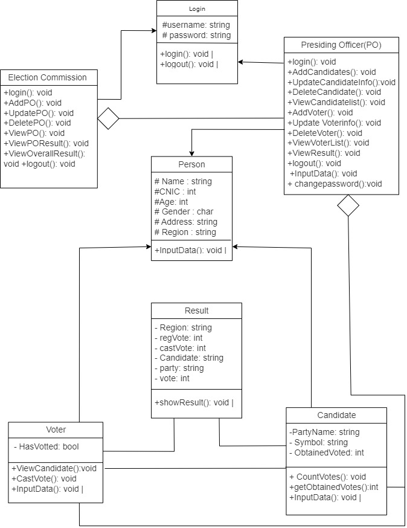

# Election Management System

<div align="center">
  
</div>

## 📋 Overview

The Election Management System is a comprehensive C++ console application designed to digitally manage and automate the entire electoral process. This system facilitates a secure, transparent, and efficient voting experience while providing robust administration tools for election officials.

## ✨ Features

### 🔐 Multi-level Access Control

- **Election Commission Admin Panel**

  - Manage presiding officers
  - Control election lifecycle (start voting, announce results)
  - Oversee the entire electoral process
- **Presiding Officer Portal**

  - Manage candidates and voters in assigned regions
  - Update candidate and voter information
  - View regional statistics and data
- **Voter Interface**

  - Secure login using CNIC
  - View available candidates in voter's region
  - Cast vote securely and privately

### 📊 Advanced Electoral Features

- **Regional Voting Management**

  - Region-specific candidate lists
  - Customized ballot displays for each region
  - Regional vote tallying and statistics
- **Real-time Statistics**

  - Track registered voters vs. votes cast
  - Display party-wise and candidate-wise results
  - Generate comprehensive election reports

### 🛡️ Security Measures

- Password-protected admin and presiding officer access
- CNIC verification for voters
- Prevention of double voting
- Audit trails for system actions

## 🏗️ System Architecture

### Object-Oriented Design

- Implemented using C++ with strong OOP principles
- Inheritance hierarchy for user types (PersonalInfo as base class)
- Abstract classes and polymorphism for login functionality
- Proper encapsulation of data and behaviors

### Data Management

- File-based persistent storage for all election data
- Separate data files for candidates, voters, presiding officers, and results
- Real-time data synchronization across the system

## 🖥️ User Interface

### Enhanced Console UI

- Color-coded interface for better readability
- Interactive menus with clear navigation
- Loading animations for better user experience
- Centered text and formatted output for professional appearance

### User-friendly Features

- Password masking for secure data entry
- Clear error messages and validations
- Confirmation prompts for critical actions
- Progress indicators for long-running processes

## 🚀 Usage Guide

### System Requirements

- C++ compiler with C++11 support or higher
- Windows operating system (for color and UI features)
- Minimum 4GB RAM recommended

### Running the Application

1. Compile the source code using a C++ compiler:
   ```
   g++ project.cpp -o election_system
   ```
2. Run the compiled executable:
   ```
   ./election_system
   ```

### Default Credentials

- **Admin Access**:

  - Username: admin
  - Password: 1234
- **Sample Presiding Officer Credentials**:

  - Username: tayyab, Password: 123 (Region: NA-68)
  - Username: sami, Password: 123 (Region: NA-69)
  - Username: shazi, Password: 123 (Region: NA-70)

## 📁 Project Structure

- **project.cpp**: Main source code file containing all classes and functionalities
- **candidate.txt**: Storage for candidate information (name, age, CNIC, gender, address, region, party, symbol)
- **voter.txt**: Storage for voter data (name, age, CNIC, gender, address, region, voting status)
- **po.txt**: Storage for presiding officer information (name, age, CNIC, gender, address, region, username, password)
- **result.txt**: Storage for election results (region, registered votes, cast votes, candidate, party, vote count)
- **UML.jpeg**: System architecture diagram showing class relationships

## 🛠️ Implementation Details

### Key Classes

- **PersonalInfo**: Base class for all users with personal details
- **Login**: Abstract interface for authentication
- **ElectionCommission**: Admin management functionalities
- **PresidingOfficer**: Regional election management
- **Voter**: Voting functionalities
- **Candidate**: Candidate information management
- **Result**: Election results tracking and reporting

### Security Features

- CNIC validation to prevent duplicate registrations
- Password protection for administrative functions
- Vote validation to prevent multiple voting

### Enhanced Visual Elements

- Custom colors for different types of information
- Progress bars for system operations
- Boxed menu designs for better user experience
- Centered headers and formatted output

## 🌟 Future Enhancements

- Biometric voter verification
- Graphical user interface (GUI)
- Database integration instead of file-based storage
- Electronic result distribution
- Mobile application for voter registration
- Advanced analytics and result visualization
- Support for different election types (general, by-elections, local)

## ⚙️ How It Works

1. **Election Setup**:

   - Admin creates presiding officers for different regions
   - Presiding officers add candidates and register voters in their regions
2. **Voting Process**:

   - Admin starts the polling process
   - Voters log in using their CNIC
   - Voters see candidates from their region and cast their vote
   - System prevents double voting
3. **Results Announcement**:

   - Admin announces results when polling is complete
   - System displays comprehensive results by region and party
   - Results can be viewed by all users

## 📊 Sample Data

The system comes pre-loaded with sample data including:

- Multiple electoral regions (NA-68, NA-69, NA-70, etc.)
- Major political parties (PTI, PMLN, PPP)
- Sample candidates and voters

## 📝 License

This project is available for educational purposes. Feel free to modify and extend it while providing appropriate attribution.

## 👨‍💻 Contributors

- Muhammad Sami

---

<div align="center">
  <p>© 2025 Election Management System</p>
  <p>A C++ Object-Oriented Programming Project</p>
</div>
